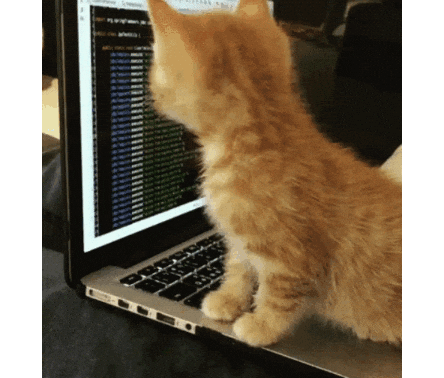

<!-- Hero image aways the cat!!! -->

 

<!-- markdownlint-disable MD033 -->

<!-- markdownlint-enable MD033 -->

 

Web developer focused on clean code, performance, and practical tools. Interested in Python, logical challenges, and exploring new technologies. I appreciate minimalist design and elegant solutions, and I am always learning and refining my approach. Outside of development, I enjoy quietly observing the world and have a special fondness for cats.

- 🌟 Web Developer & Python enthusiast
- 🚀 Always exploring new technologies and building useful tools
- 🎯 2026 Goals: Create clean, minimal apps and improve coding skills
- 🧩 Enjoy solving logic challenges and improving problem-solving skills
- 🐾 Fun fact: I quietly admire cats (sometimes even coding with them in mind)
- ✉️ How to reach me: erickaciolisilva@gmail.com